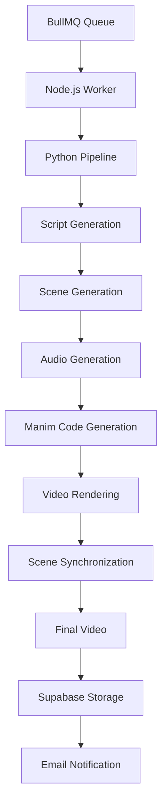
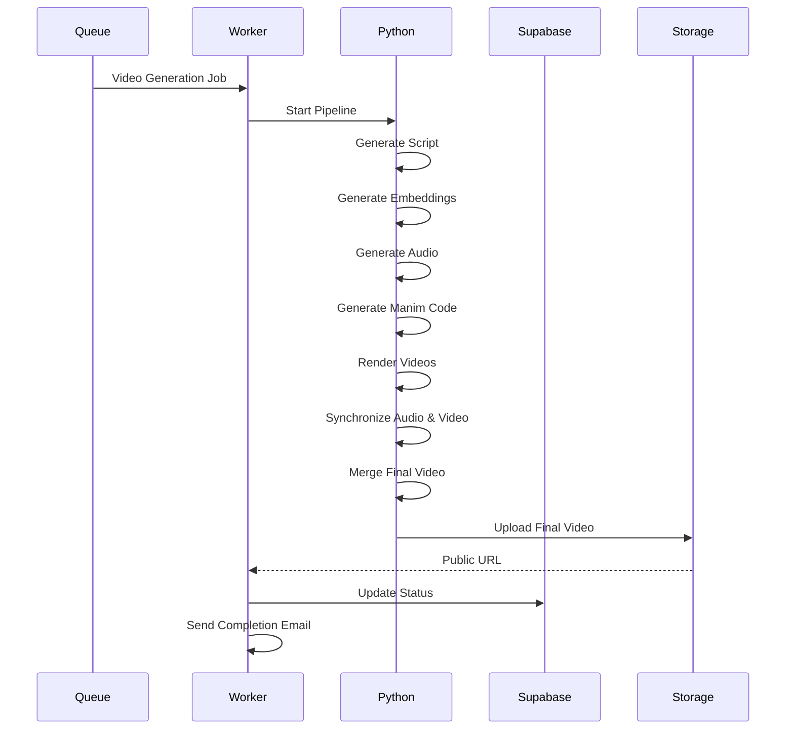

# 🎬 AnimEd Worker

Background processing service responsible for generating AI-powered educational videos for **AnimEd**.

Unlike the API server, this repository focuses entirely on long-running compute-intensive workloads. It consumes jobs from BullMQ, orchestrates a multi-stage Python pipeline, renders educational animations using Manim, synchronizes narration with generated visuals, uploads the final video to cloud storage, and updates the platform once processing completes.

---

# High-Level Design (HLD)

## 1. Core Purpose

AnimEd Worker is responsible for executing the complete video generation pipeline asynchronously.

Its responsibilities include:

* Consuming video generation jobs from BullMQ.
* Downloading uploaded study material.
* Generating educational scripts using LLMs.
* Producing transcript embeddings for future RAG queries.
* Rendering animated educational scenes using Manim.
* Synchronizing narration audio with generated animations.
* Uploading final videos to Supabase Storage.
* Updating video status and notifying users upon completion.

---

# 2. Technology Stack

| Component        | Technology              | Purpose                                  |
| ---------------- | ----------------------- | ---------------------------------------- |
| Worker Runtime   | Node.js                 | BullMQ job consumer and orchestration    |
| Queue            | BullMQ + Redis          | Distributed background processing        |
| AI               | OpenAI / Groq APIs      | Script and animation generation          |
| Rendering        | Manim Community Edition | Educational animation rendering          |
| Audio            | gTTS + FFmpeg           | Voice generation and media processing    |
| Database         | Supabase PostgreSQL     | Metadata, embeddings and status tracking |
| Storage          | Supabase Storage        | Final video and script storage           |
| Containerization | Docker                  | Portable execution environment           |

---

# 3. High-Level Architecture

---

# 4. Processing Pipeline

## Stage 1 — Job Execution

The Node.js worker continuously listens for new BullMQ jobs.

For every incoming request it:

* Downloads uploaded notes (if provided)
* Creates an isolated working directory
* Spawns a dedicated Python process
* Streams logs throughout execution
* Updates processing status in the database

---

## Stage 2 — Script Generation

The Python pipeline generates an educational lecture script.

Depending on user input:

* Topic-based generation
* PDF/DOCX/TXT extraction
* Automatic summarization for large documents
* Structured JSON scene generation

Generated scripts are uploaded to Supabase Storage.

---

## Stage 3 — Embedding Generation

After script creation:

* Text is chunked into smaller sections.
* Sentence embeddings are generated locally.
* Embeddings are stored in PostgreSQL (pgvector).

This enables efficient Retrieval-Augmented Generation (RAG) within the backend.

---

## Stage 4 — Animation Generation

For every scene:

* Generate narration audio.
* Generate Manim animation code using an LLM.
* Render animations using Manim.
* Automatically retry using simplified prompts if rendering fails.

Each scene is processed independently.

---

## Stage 5 — Audio Synchronization

Generated animations rarely match narration duration.

The worker automatically:

* Measures video duration
* Measures narration duration
* Adjusts playback speed
* Synchronizes both streams
* Produces a final scene video

---

## Stage 6 — Final Compilation

After all scenes finish:

* Merge all rendered scenes.
* Produce a single educational video.
* Upload the final output to Supabase Storage.
* Update database status.
* Send completion email to the user.
* Clean temporary files.

---

# 5. Fault Tolerance

The rendering pipeline includes multiple recovery mechanisms.

## BullMQ

* Job retry support
* Durable Redis-backed queues
* Independent worker execution

## Manim Code Generation

If rendering fails:

1. Retry using a simplified animation prompt.
2. Retry using a minimal text-only prompt.
3. Continue processing remaining scenes whenever possible.

This significantly improves successful video generation despite imperfect LLM outputs.

---

# 6. Design Decisions

## Why BullMQ?

Video rendering can take several minutes.

Using BullMQ allows:

* Non-blocking API responses
* Horizontal worker scaling
* Retry support
* Background execution

---

## Why Separate Node.js and Python?

Node.js is responsible for orchestration while Python handles AI and rendering workloads.

Benefits:

* Better separation of responsibilities
* Independent scaling
* Cleaner architecture
* Easier maintenance

---

## Why Docker?

Rendering requires a complex runtime including:

* Python
* Node.js
* FFmpeg
* Manim
* LaTeX
* Graphics libraries

Docker provides a reproducible execution environment across development and deployment.

---

## Why Multi-stage Rendering?

Educational videos require multiple independent processing stages.

Instead of generating everything at once, the pipeline separates:

* Script generation
* Audio generation
* Animation generation
* Video synchronization
* Final compilation

This improves modularity, debugging and failure recovery.

---

# 7. Video Generation Flow

---

# 8. Docker Architecture

The worker uses two Docker images.

**Dockerfile.base**

Contains all heavy system dependencies:

* Python
* Node.js
* Manim
* FFmpeg
* LaTeX
* Required libraries

This image changes infrequently and is reused across builds.

**Dockerfile.worker**

Builds on top of the base image by copying only the application source code.

Benefits:

* Faster image builds
* Better layer caching
* Smaller incremental deployments

---

# 9. Future Improvements

* Kubernetes-based worker autoscaling
* GPU-accelerated rendering
* Parallel scene rendering
* Distributed worker clusters
* Streaming progress updates
* Dead-letter queue support
* Intelligent render caching
